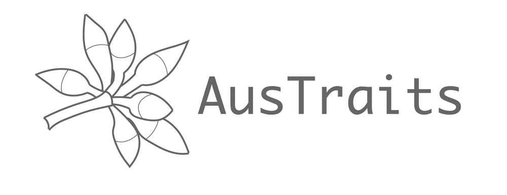

# `austraits.build`: source for `AusTraits`

<!-- badges: start -->

<!-- badges: end -->

AusTraits is a transformative database, containing measurements on the
traits of Australia’s plant species, standardised from hundreds of
disconnected primary sources. So far, data have been assembled \> 250
distinct sources, describing more than 400 plant traits and over 25k
taxa.

## Usage and access

Those interested in simply using data from AusTraits, should visit download the
compiled resource from the versioned releases archived on Zenodo at doi:
    [10.5281/zenodo.3568417](http://doi.org/https://doi.org/10.5281/zenodo.3568417).

There you will also find detailed information regarding appropriate use
of AusTraits.

## We’re always rebuilding

This repository (`austraits.build`) contains the raw data and code used to compile AusTraits from diverse, original sources.

To handle the harmonising of diverse data sources, we use a reproducible
workflow to implement the various changes required for each source to
reformat it suitable for incorporation in AusTraits. Such changes
include restructuring datasets, renaming variables, changing variable
units, changing taxon names. For the sake of transparency and continuing
development, the entire workflow is made available here.

AusTraits is continually evolving, as new datasets are contributed. As
such, there is no single canonical version. We are continually making
new versions available. Overtime, we expect that different versions will
be released and used in different analyses.

## Contributing

We envision AusTraits as an on-going collaborative community resource
that:

1.  Increases our collective understanding the Australian flora; and
2.  Facilitates accumulating and sharing of trait data;
3.  Builds a sense of community among contributors and users; and
4.  Aspires to fully transparent and reproducible research of highest
    standard.

As a community resource, we are very keen for people to contribute. 

For anyone working with the [austraits.build](https://github.com/traitecoevo/austraits.build/) repository, detailed documentation is available at  [our website](http://traitecoevo.github.io/austraits.build/), or in the docs folder.

## Acknowledgements

**Funding**: This work was supported via the following funding sources:
fellowship grants from Australian Research Council to Falster
(FT160100113), Gallagher (DE170100208) and Wright (FT100100910), a grant
from Macquarie University to Gallagher, and grants from the[Australian
Research Data Commons (ARDC)](https://ardc.edu.au), via their
“Transformation data collections” [doi:
10.47486/TD044](https://doi.org/10.47486/TD044) and “Data Partnerships”
[doi: 10.47486/DP720](https://doi.org/10.47486/DP720) programs. The ARDC
is enabled by NCRIS.

**Recognition**: At this stage, only the compiled dataset available via
[traitecoevo/austraits](https://github.com/traitecoevo/austraits.build/)
is available for reuse. The raw data sources provided in this repository
are not available for reuse in their current form, without further
discussion from data contributors.
