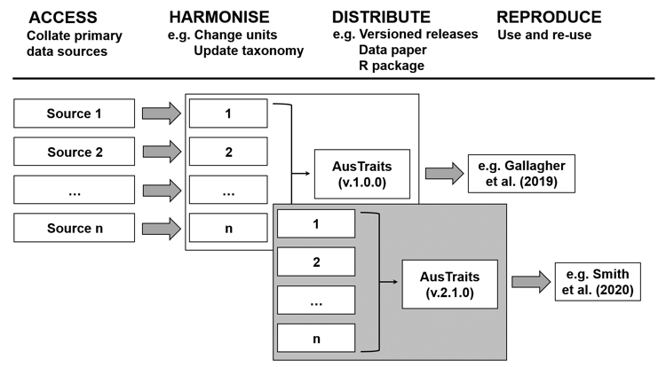

```{r, include = FALSE}
knitr::opts_chunk$set(
  collapse = TRUE,
  comment = "#>",
  results = "asis"
)


library(austraits.build)
library(dplyr)
library(readr)

root.dir = rprojroot::find_root("remake.yml")
knitr::opts_knit$set(root.dir = root.dir)

my_kable_styling <- my_kable_styling_html
```

```{r, echo=FALSE, results='hide', message=FALSE}
## Assumes to items exist in global name space
if(!exists("austraits")) {
  austraits <- readRDS("export/data/austraits.rds")
  # stop("austraits must exist in global name space to knit a report")
}

definitions <- austraits$definitions
```


# Mission

These documents describes the compiling of AusTraits - a database of traits for the Australian Flora. It was generated using AusTraits **version `r desc::desc_get_field("Version")`**, which harmonises data on `r austraits$traits$trait_name %>% unique() %>% length()` traits from `r austraits$traits %>% pull(dataset_id) %>% n_distinct()` different sources, including field campaigns, published literature, taxonomic monographs, and individual species descriptions. Traits link to ecological strategy variation and vary in scope from physiological measures of performance (e.g. photosynthetic gas exchange, water-use efficiency) to morphological parameters (e.g. leaf size, seed size, maximum height). AusTraits contains curated and harmonised species- and genus-level observations coupled to, where available, contextual information on site properties. 

We envision AusTraits as an on-going collaborative community resource that:

1. Increases our collective understanding the Australian flora;
2. Facilitates accumulating and sharing of trait data;
3. Aspires to fully transparent and reproducible research of highest standard, and 
4. Builds a sense of community among contributors and users.

Prior to the development of AusTraits, data on Australian plant traits existed as a series of largely disconnected datasets collected by individual laboratories or initiatives. Our goal has been to harmonise these different sources. Moreover, we aimed to do this in an open-source way, so as to accelerate discoveries about Australian plants.

We therefore set out to build a resource with the following features:

* The workflow for harmonising different datasets is made fully open and reproducible;
* All data are shared under a standard open license permitting reuse;
* Successive versions of the data remain available to ensure reproducibility of research;
* Contributions towards AusTraits are recognised via invitations to co-author data papers, i.e. releases of the data resource, and subsequent citation. 
* Users of AusTraits are encouraged to contribute towards the further improvement of the database.

A key goal for us was to make the process for harmonising different datasets as transparent as possible. Our workflow is therefore fully-reproducible and open, meaning it exposes the decisions made in the processing of data into a harmonised and curated dataset (Figure 1); and can also be rerun by others (see section on [compiling AusTraits](#compiling)).



# Ways to contribute

Here are some of the ways you can contribute: 

**Reporting Errors**: If you notice a possible error in AusTraits, please [post an issue on GitHub](https://github.com/traitecoevo/austraits.build/issues) . If you can, please provide code illustrating the problem.

**Refining documentation:** Data contributors and data users who are less familiar with the AusTraits format and code than the custodians may determine that important descriptions or steps are omitted from this documentation file. We welcome additions and edits that make using the existing data or adding new data easier for the community.

**Value adding / expanding existing data**: If you would like to value-add to AusTraits in some other way, please get in contact by [posting an issue](https://github.com/traitecoevo/austraits.build/issues) with an idea or offer of time.

**Contributing new data**: We gladly accept new data contributions to AusTraits. If you would like to contribute data, the requirements are:

- Data were collected for Australian plant species growing in Australia
- You collected data on one of the traits listed in the [trait definitions table](Trait_definitions.md).
- You are willing to release the data under an open license for reuse by the scientific community.
- You make it is as easy as possible for us to incorporate your data by carefully following the instructions.

Please note that the austraits project is released with a [Contributor Code of Conduct](../.github/CODE_OF_CONDUCT.md). By contributing to this project you agree to abide by its terms.

# Compiling AusTraits

In this section we describe how to build the harmonised dataset. By "compiling" we mean transforming data from all the different studies into a harmonised common format. As described above and depicted in Figure 1, AusTraits is built so that you can rebuild the database from its parts at any time. This means that decisions made along the way, in how data are transformed or encoded, can be inspected and modified. And new data is easily incorporated.

## Github repository

All the raw materials and code needed are stored in our github repository  [`austraits.build`](https://github.com/traitecoevo/austraits.build/). Github provides a commercial web platform  for sharing, visualizing, and managing data or code under version control. It includes ability to browse the "history" of the repository, "issue" tracking, and ability to host "releases". It also enables multiple contributors to work simultaneously on the same project. While traditionally used for storing code, Github is also being used to store data, especially where there are multiple contributors ([Perkel 2016](http://doi.org/10.1038/538127a), [Falster et al 2019](http://doi.org/10.1093/gigascience/giz035)).

The first step to compile AusTraits is to download a copy of the [austraits.build](https://github.com/traitecoevo/austraits.build/) repository from Github. Then open up the Rstudio project, or open R into the right directory.

## What type of repo is this?

This repository is partway between an R package and a "compendium". 

Primarily it's a compendium, meaning it contains code and data which produce outputs. But it's structured a bit like a package, so that we ca. use some of R's package management tools to 

- use a DESCRIPTION file to document our dependencies
- create our documentation, using the package pkgdown
- run tests on our datasets (using testthat)
- manage and build vignettes
- use the devtools function to load functions.

## Install dependencies via `devtools`

To check you have the right packages installed, you can use the [`devtools`](https://devtools.r-lib.org) package to run:

```{r, eval=FALSE, echo=TRUE}
# install.packages("devtools)  # install devtools if needed
devtools::install_deps()
```

This command checks that the required packages, listed in the file `DESCRIPTION` are available in your local machine. 

## Compile via `remake`

One of the packages that will be installed with the above is [`remake`](https://github.com/richfitz/remake). This package manages the compiling, and also helps streamline the amount of recompiling needed when new sources are added.

Running the following command will rebuild AusTraits and save the assembled dataset into a file `export/data/austraits.rds`. 

```{r, eval=FALSE}
remake::make()
```

Remake can also load the compiled dataset directly into R by calling:

```{r, eval=FALSE}
austraits <- remake::make("austraits")
```


